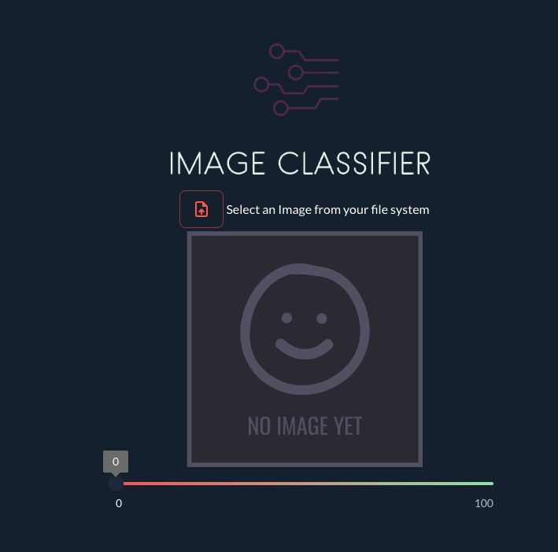

# Image Classifier

## Overview

This image classifier uses a Convolutional Neural Network (CNN) built with TensorFlow to classify images from the CIFAR10 dataset. The CIFAR10 dataset includes 60,000 32x32 color images categorized into 10 classes: airplanes, automobiles, birds, cats, deer, dogs, frogs, horses, ships, and trucks. To enhance user interaction, I developed a graphical user interface (GUI) using Taipy, allowing users to easily upload images and receive classification results.

## Features

- **Model Architecture**: The CNN model comprises several convolutional, pooling, and fully connected layers designed to extract and learn features from the input images, leading to accurate classification.
- **Data Augmentation**: I applied data augmentation techniques like rotation, flipping, and zooming to increase the diversity of the training data, helping the model generalize better on unseen data.
- **Model Training and Evaluation**: The model was trained using the Adam optimizer, and its performance was evaluated on a separate test set. Key metrics such as accuracy and loss were tracked, and a confusion matrix was generated to provide insights into the model's strengths and weaknesses across different classes.
- **Interactive GUI**: The Taipy GUI allows users to interact with the model by uploading their images and viewing the classification results. This interface makes the image classifier accessible to a wider audience, including those without a technical background.

## Technologies Used

- **TensorFlow**: Utilized for building and training the CNN.
- **Pillow**: Employed for image processing tasks, such as loading and manipulating images before classification.
- **Numpy**: Used for numerical operations, including the normalization of image data.
- **Taipy GUI**: Developed the user interface, enabling easy interaction with the model.

## Visuals

### Interface Preview

### Video Walkthrough

## Achievements

- Successfully built and trained a CNN model to classify images from the CIFAR10 dataset with high accuracy.
- Created an interactive GUI that simplifies the process of image classification, making the technology more accessible.
- Gained experience in combining machine learning with user interface development, particularly through the use of TensorFlow and Taipy.

## Future Directions

- Experiment with different CNN architectures to further improve classification accuracy.
- Integrate transfer learning using pre-trained models to enhance performance.
- Expand the GUI with additional features, such as real-time image classification and advanced result visualization options.

---

